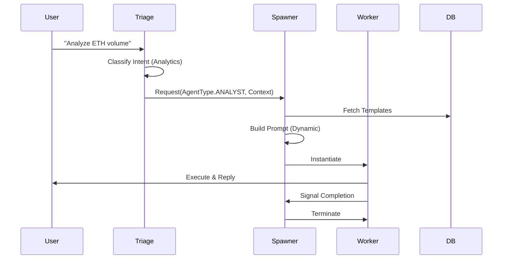

# Strategic Architecture: ARTEMIS Porting Plan

## 1. Architecture Pattern
We will integrate ARTEMIS concepts into the **CFA (Cognitive Fusion Architecture)** of `codeswarm`.

### Layer Integration
*   **L1 (Sensation):** Unchanged (Market Data).
*   **L2 (Perception):** **New Triage Layer.** A lightweight router agent that analyzes intent before the full Team is engaged.
*   **L3 (Cognition):** **Dynamic Prompting.** Agents in this layer (Analyst, Trader) will have their instructions built at runtime.
*   **L4 (Action):** **Ephemeral Workers.** Specific tasks (e.g., "Verify Token Contract") will spawn a disposable agent rather than using a generalist.

## 2. Domain Decomposition

### Domain: DynamicPrompting (`backend/scaffolding/`)
*   **Responsibility:** Assembling system prompts from fragments.
*   **Components:**
    *   `PromptBuilder`: The builder pattern implementation.
    *   `PromptTemplate`: Value objects holding template strings.
    *   `ContextInjector`: Injects real-time data (Time, Market State) into the prompt.

### Domain: AgentLifecycle (`backend/orchestration/`)
*   **Responsibility:** Managing the birth and death of agents.
*   **Components:**
    *   `AgentSpawner`: Factory service to create agents on demand.
    *   `AgentRegistry`: Tracks active ephemeral agents.
    *   `TriageUnit`: The decision engine for spawning.

## 3. Technology Decisions (ADRs)

### ADR-001: Python-Native Spawning
*   **Decision:** Implement `AgentSpawner` using Python classes and `Agno` factories, NOT Docker containers.
*   **Rationale:**
    *   **Constraints:** Sandbox environment limits Docker usage.
    *   **Performance:** Lower overhead for intra-process communication.
    *   **Compatibility:** Native integration with existing `backend/agents/__init__.py`.

### ADR-002: Jinja2-based Prompting
*   **Decision:** Use `Jinja2` for `PromptBuilder`.
*   **Rationale:**
    *   Powerful logic (loops, conditionals) within templates.
    *   Standard Python library for text generation.
    *   Superior to simple `f-string` for complex conditional instructions.

## 4. Data Flow (Triage -> Spawn -> Execute)

