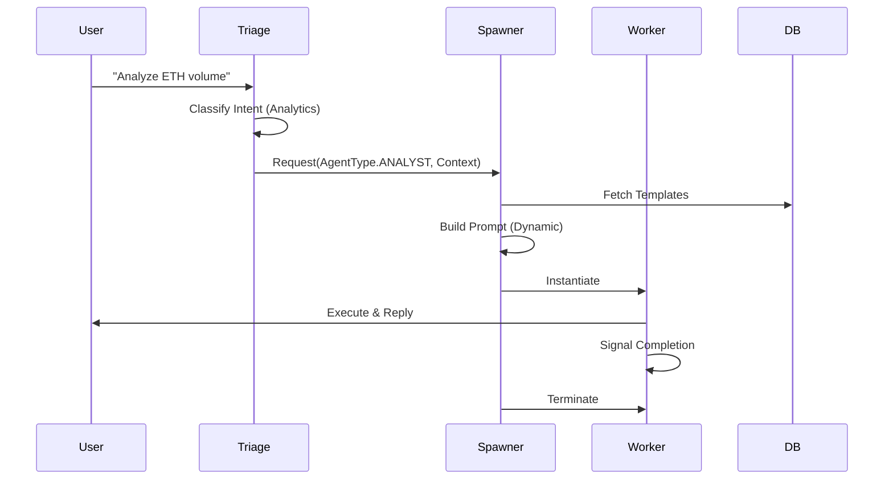

# Strategic Architecture: ARTEMIS Porting Plan

## 1. Architecture Pattern
We will integrate ARTEMIS concepts into the **CFA (Cognitive Fusion Architecture)** of `codeswarm`.

### Layer Integration
*   **L1 (Sensation):** Unchanged (Market Data).
*   **L2 (Perception):** **New Triage Layer.** A lightweight router agent that analyzes intent before the full Team is engaged.
*   **L3 (Cognition):** **Dynamic Prompting.** Agents in this layer (Analyst, Trader) will have their instructions built at runtime.
*   **L4 (Action):** **Ephemeral Workers.** Specific tasks (e.g., "Verify Token Contract") will spawn a disposable agent rather than using a generalist.

## 2. Domain Decomposition

### Domain: DynamicPrompting (`backend/scaffolding/`)
*   **Responsibility:** Assembling system prompts from fragments.
*   **Components:**
    *   `PromptBuilder`: The builder pattern implementation.
    *   `PromptTemplate`: Value objects holding template strings.
    *   `ContextInjector`: Injects real-time data (Time, Market State) into the prompt.

### Domain: AgentLifecycle (`backend/orchestration/`)
*   **Responsibility:** Managing the birth and death of agents.
*   **Components:**
    *   `AgentSpawner`: Factory service to create agents on demand.
    *   `AgentRegistry`: Tracks active ephemeral agents.
    *   `TriageUnit`: The decision engine for spawning.

## 3. Technology Decisions (ADRs)

### ADR-001: Python-Native Spawning
*   **Decision:** Implement `AgentSpawner` using Python classes and `Agno` factories, NOT Docker containers.
*   **Rationale:**
    *   **Constraints:** Sandbox environment limits Docker usage.
    *   **Performance:** Lower overhead for intra-process communication.
    *   **Compatibility:** Native integration with existing `backend/agents/__init__.py`.

### ADR-002: Jinja2-based Prompting
*   **Decision:** Use `Jinja2` for `PromptBuilder`.
*   **Rationale:**
    *   Powerful logic (loops, conditionals) within templates.
    *   Standard Python library for text generation.
    *   Superior to simple `f-string` for complex conditional instructions.

## 4. Data Flow (Triage -> Spawn -> Execute)

## 5. Cognitive Fusion & Self-Correction (Research Integration)

We are integrating advanced cognitive patterns derived from recent research to enhance agent robustness and reasoning depth.

### 5.1 Cognitive Refinement Protocol (AVI - 2511.14446)
*   **Goal:** Move from simple ReAct loops to a structured **Retrieve-Perceive-Review** cycle.
*   **Implementation:**
    *   **Retrieve:** Gather raw data (Market Data, Technicals).
    *   **Perceive:** Apply quantitative models and signal processing.
    *   **Review:** Synthesize findings and decide to *refine* (loop back) or *act*.
*   **Component:** `CognitiveCoordinator` agent to manage this state machine.

### 5.2 Codebase Self-Awareness (InfCode - 2511.16005)
*   **Goal:** Enable agents to reason about the system's own code structure, facilitating self-diagnosis and "DevOps" capabilities.
*   **Implementation:**
    *   **AST Indexing:** A service to parse and index `backend/` source code.
    *   **CodebaseToolkit:** Tools for semantic (Intent-to-Code) and structural (AST) queries.

### 5.3 Agentic Verification Loop (AutoRocq - 2511.17330)
*   **Goal:** Robust error handling through iterative refinement.
*   **Implementation:**
    *   **Task Tree:** Structured representation of goals and sub-goals.
    *   **Refinement Loop:** Catching specific tool errors (e.g., `SlippageError`) and autonomously adjusting parameters before retrying.

### 5.4 Intelligent Knowledge Retrieval (DataSage - 2511.14299)
*   **Goal:** Reduce noise and cost by searching only when necessary.
*   **Implementation:**
    *   **Judge Logic:** A decision step to validate the need for external search (RAKG).
    *   **Knowledge Synthesis:** Structuring search results into persistent "Knowledge Items" in `KhalaMemory`.

### 5.5 Capability-Based Orchestration (Octopus - 2511.15351)
*   **Goal:** Move from flat tool lists to high-level "Capabilities" to simplify agent decision-making.
*   **Implementation:**
    *   **Capability Manager:** A registry mapping capabilities (e.g., "OnChainAnalysis") to specific tools (`DexToolkit`).
    *   **Dynamic Tool Loading:** Agents request capabilities, and the system loads the relevant toolset.

### 5.6 Mixture of Retrievers (MoRA-RAG - 2511.14010)
*   **Goal:** Enhance memory recall by combining different retrieval strategies.
*   **Implementation:**
    *   **Hybrid Search:** Combine Vector Search (Semantic) with Keyword Search (Lexical) in `KhalaMemory`.
    *   **Graph Retrieval:** (Future) Integrate Graph-based queries if/when a Financial Knowledge Graph is built.

### 5.7 Faithful Reasoning Traces (Faithful CoT - 2501.08156)
*   **Goal:** Ensure agent reasoning is transparent and matches its actions.
*   **Implementation:**
    *   **Reasoning Logger:** Explicitly log the "Thought" component of the CoT process separately from the "Action".
    *   **Verification Step:** A post-action check (or separate agent) to verify that the executed action aligns with the stated reasoning.

### 5.8 Reasoning Profiles (Distilled Reasoning - 2503.03730)
*   **Goal:** Steer agent behavior dynamically using specialized system prompts.
*   **Implementation:**
    *   **Profile Registry:** A library of system prompt fragments (e.g., "Skeptic", "Optimist", "Risk-Averse").
    *   **Integration:** Feed these profiles into the `PromptBuilder` (Domain 2).
