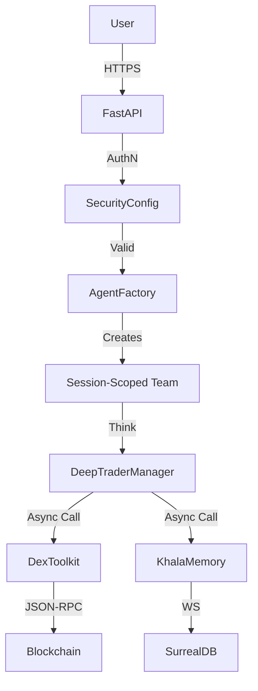

# System Architecture

## Overview
CryptoSentinel is a multi-agent autonomous cryptocurrency trading system. It utilizes the **Agno** framework for agent orchestration and **FastAPI** for the backend interface.

## Module Boundaries

### 1. Backend Core (`backend/`)
*   **`main.py` (API Layer):**
    *   **Responsibility:** Authentication, Rate Limiting, Request Routing.
    *   **Constraint:** Must NOT contain business logic. Delegates immediately to Agents.
*   **`agents/__init__.py` (Orchestration Layer):**
    *   **Responsibility:** Agent Team Factory.
    *   **Pattern:** **Factory Method**. Must instantiate NEW agents for every `session_id`.
*   **`config.py` (Configuration):**
    *   **Responsibility:** Env var loading, Secret management.
    *   **Constraint:** Immutable after startup.

### 2. Tooling Layer (`backend/tools/`)
*   **Design Pattern:** Class-based Toolkits inheriting from `agno.tools.toolkit.Toolkit`.
*   **Constraint:** All network calls must be **Async**.
*   **Modules:**
    *   `DexToolkit`: Web3 interactions (Swap, Approve). *Must use shared connection pool.*
    *   `PortfolioToolkit`: Database read/write for positions.
    *   `MarketDataToolkit`: CoinGecko/External API fetchers.
    *   `AssetManagementToolkit`: Security checks, transfers.

### 3. Storage Layer (`backend/storage/`)
*   **`sqlite.py`:** SQLAlchemy-based persistence.
*   **`khala_integration.py`:** Bridge to SurrealDB/Vector Memory.
*   **Constraint:** Use `Decimal` for all financial data. No `floats`.

### 4. Frontend (`src/`)
*   **`services/api.ts`:** API Client.
    *   **Constraint:** Secure token storage (HttpOnly/SessionStorage).
*   **Components:** Visual presentation only. No business logic.

## Data Flow Diagram

